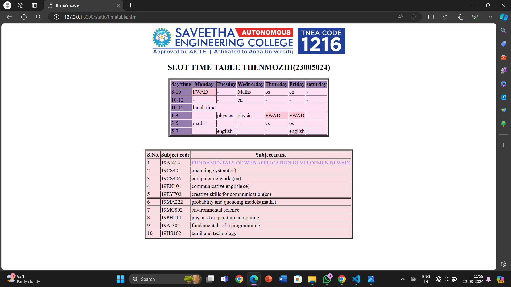

# Ex03 Time Table
## Date:22-3-24

## AIM
To write a html webpage page to display your slot timetable.

## ALGORITHM
### STEP 1
Create a Django-admin Interface.

### STEP 2
Create a static folder and inert HTML code.

### STEP 3
Create a simple table using ```<table>``` tag in html.

### STEP 4
Add header row using ```<th>``` tag.

### STEP 5
Add your timetable using ```<td>``` tag.

### STEP 6
Execute the program using runserver command.

## PROGRAM
```
<html>
    <head>
        <title>
            thenu's page  
        </title>
      
    </head>
    <body>
        <center>
        
        <h2> SLOT TIME TABLE THENMOZHI(23005024)</h2>

        <table border="5" bgcolor="FFDFF3">
            <tr bgcolor="957DAD">
                <th>day/time</th>
                <th>Monday</th>
                <th>Tuesday</th>
                <th>Wednesday</th>
                <th>Thursday</th>
                <th>Friday</th>
                <th>saturday</th>
            </tr>
            <tr>
                <td bgcolor="957DAD">8-10</td>
                <td bgcolor="FEC8D8">FWAD</td>
                <td>-</td>
                <td>Maths</td>
                <td>os</td>
                <td>cn</td>
                <td>-</td>
            </tr>
            <tr>
                <td bgcolor="957DAD">10-12</td>
                <td>-</td>
                <td>-</td>
                <td>cn</td>
                <td>-</td>
                <td>-</td>
                <td>-</td>
            </tr>
            <tr>
                <td bgcolor="957DAD">1-3</td>
                <td>-</td>
                <td>physics</td>
                <td>physics</td>
                <td bgcolor="FEC8D8">FWAD</td>
                <td bgcolor="FEC8D8">FWAD</td>
                <td>-</td>
            </tr>
            <tr>
                <td bgcolor="957DAD">3-5</td>
                <td>maths</td>
                <td>-</td>
                <td>-</td>
                <td>cs</td>
                <td>os</td>
                <td>-</td>
            </tr>
            <tr>
                <td bgcolor="957DAD">5-7</td>
                <td>-</td>
                <td>english</td>
                <td>-</td>
                <td>-</td>
                <td>english</td>
                <td>-</td>
            </tr>
           
        </table>
        <br>
        <br>
        <table border="5" bgcolor="FADDE3">
            <tr>
                <th>S.No.</th>
                <th>Subject code</th>
                <th>Subject name</th>
            </tr>
            <tr>
                <td>1</td>
                <td>19AI414</td>
                <td><font color="AC88E8">FUNDAMENTALS OF WEB APPLICATION DEVELOPMENT(FWAD)</font></td>
            </tr>
            <tr>
                <td>2</td>
                <td>19CS405</td>
                <td>operating system(os)</td>
            </tr>
            <tr>
                <td>3</td>
                <td>19CS406</td>
                <td>computer networks(cn)</td>
            </tr>
            <tr>
                <td>4</td>
                <td>19EN101</td>
                <td>communicative english(ce)</td>
            </tr>
            <tr>
                <td>5</td>
                <td>19EY702</td>
                <td>creative skills for communication(cs)</td>
            </tr>
            <tr>
                <td>6</td>
                <td>19MA222</td>
                <td>probablity and queueing models(maths)</td>
            </tr>
            <tr>
                <td>7</td>
                <td>19MC802</td>
                <td>environmental science</td>
            </tr>
            <tr>
                <td>8</td>
                <td>19PH214</td>
                <td>physics for quantum computing</td>
            </tr>
            <tr>
                <td>9</td>
                <td>19AI304</td>
                <td>fundamentals of c programming</td>
            </tr>
            <tr>
                <td>10</td>
                <td>19HS102</td>
                <td>tamil and technology</td>
            </tr>
        </table>
    </center>
    </body>
</html>
```

## OUTPUT


## RESULT
The program for creating slot timetable using basic HTML tags is executed successfully.
